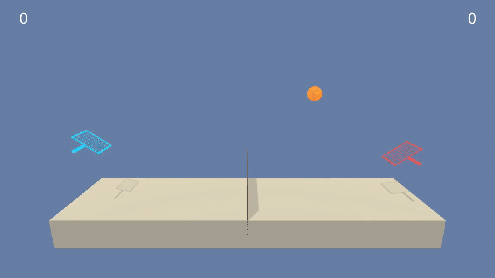

# Project 3: Collaboration and Competition Submission Report

## Summary

For this project, I implemented Proximal Policy Optimization to solve the Tennis environment in around 1500 episodes. 
The Policy-Network used was simply fully connected.

## Approach and Algorithm Choice

In order to tackle this cooperative multi-agent problem, I first had a quick look at the state space definition for both players:

```buildoutcfg
Agent 0: 
State: 
[[-1.08997889e+01 -1.85216200e+00 -9.53674316e-06  0.00000000e+00 -6.05859756e+00 -8.10827911e-02 -9.53674316e-06  0.00000000e+00]
 [-1.08997889e+01 -1.85216200e+00 -9.53674316e-06  0.00000000e+00 -6.05859756e+00 -1.00070286e+00 -9.53674316e-06  0.00000000e+00]
 [-1.08997889e+01 -1.85216200e+00 -9.53674316e-06  0.00000000e+00 -6.05859756e+00 -1.92032266e+00 -9.53674316e-06  0.00000000e+00]]
Agent 1: 
State: 
[[-1.08997898e+01 -1.85216272e+00 -9.53674316e-06  0.00000000e+00  6.05859756e+00 -8.10827911e-02 -9.53674316e-06  0.00000000e+00]
 [-1.08997898e+01 -1.85216272e+00 -9.53674316e-06  0.00000000e+00  6.05859756e+00 -1.00070286e+00 -9.53674316e-06  0.00000000e+00]
 [-1.08997898e+01 -1.85216272e+00 -9.53674316e-06  0.00000000e+00  6.05859756e+00 -1.92032266e+00 -9.53674316e-06  0.00000000e+00]]
```

I noticed that first of all, in contrast to the description, the state space consists not only of
position/velocity x,y of paddle and position/velocity xy of ball, but also of 3 previous samples stacked on top of each other. 
This means that the state space for each agent is 24 and it should improve learning the motion of the ball.
Second of all, the state spaces for both agents are set up in a way that the problem is symmetric, 
i.e. without altering anything one can use self-play with the same policy for both agents.

That means I could use PPO or DDPG similar to the previous assignment. 
I decided to go for PPO, as I expected better convergence for these sparse rewards (hit ground or ball over net). 
The network chosen were two fully connected neural networks for actor (that returns an action mean and std) 
and the critic (which returns the expected value from a particular state and action).

The normal distribution in the actor network with an initial standard deviation of 1 allows balancing exploration at the beginning of the training and reduces over the time of training.

As both agents are having the same policy, they both share actor and critic network during training.
 
The algorithm was implemented after [click here](https://arxiv.org/abs/1707.06347):
 
```
Proximal Policy Optimization Algorithms
John Schulman, Filip Wolski, Prafulla Dhariwal, Alec Radford, Oleg Klimov

```

## Software Structure

### How to run

#### Training 
In order to train the agent, please run ```trainAgent.py```. This will
1. Setup the unity environment
2. Setup the agent with used hyperparameters
3. Train the agent and show the trained rewards
4. Save the best model weights in model/model.pth

#### Inference
In order to run the already trained agent, please run ```runAgent.py```

### Policy Network 
```Model.py``` contains the class ```PPOPolicyNetwork``` that represents the learned policy. 
Given a state input x, the network will provide a sampled action, the log-probability of selecting that action 
and the estimated value of the (x,a) pair for the rest of the epoch 

### PPOAgent
```PPOAgent.py``` contains the code to train the policy based on *Proximal Policy Optimization* (PPO). 

The ```Agent``` class is not aware of the structure of the policy representation, so different implementations can be plugged in on construction. 

## Chosen Network structure
As the state and action space are both relatively small, I decided to use a fully connected layers with 2 hidden layers with 256 neurons each.

## Chosen Hyperparameters for training

The hyperparameters chosen were a result of experience of previous assigments plus trial and error on the current task. 
For example, longer rollouts didn't contribute to the results especially at the beginning of the training, 
as the episodes ended quite quickly when the policy was not able to keep the ball in the air. 

| Parameter           | Value         |   Description                                                                     | 
| -------------       |:-------------:| -------------------------------------------------------------------------------   | 
| learning_rate       | 1e-4          | Hyperparameter for model weight updates                                           |
| adam_epsilon        | 1e-5          | Epsilon parameter for adam optimizer                                              | 
| hidden_size         | 256           | size of each layer of the policy network (2 fully connected layers                |   
| rollout_length      | 1000          | The number of steps to collect trajectories for approximating the policy gradient | 
| mini_batch_number   | 32            | The number of minibatches to train based on the collected rollouts                | 
| optimization_epochs | 100           | The number of epochs to train with one set of rollouts                            |
| ppo_clip            | 0.2           | Clipping for the objective function                                               |
| gradient_clip       | 5.0           | Clipping for overall loss gradient                                                |
| entropy_coefficent  | 0.01          | How much is the entropy loss term weighted against the objective loss term        | 
| discount_rate       | 0.99          | Discount factor of the reward function                                            |
| lambda              | 0.95          | Additional (to discount rate) downscaling of advantages over time                 |

## Results

With the described model structure and hyperparameters, 
the agent was able to solve (average score>0.5 over 100 episodes) the environment in around 1500 episodes:


blue shows the score for each episode, orange the average score over the last 100 episodes and 
green shows the desired score (0.5) in order to solve the environment.

Although the environment was solved after around 1500 episodes, 
the average score dropped under the required performance twice during training. 
So although improving over the 5000 epochs, it was not very stable and probably further hyperparameter tuning could help here.  
The best performance was at 4000 episodes with an average score of 2.

The graph shows, that the rewards that were collected are highly unstable even after the policy learned is
already a good strategy for both paddles to play together.  

Here is a gif of the resulting policy after 5000 episodes:



The trained model weights are saved in model/model.pth

## Future Improvements

1. Hyperparameter tuning to get faster convergence or more stable training. Rollout length/number of optimization epochs, 
and mini batch size could help to stabilize
1. Try with [MADDPG](https://arxiv.org/abs/1706.02275). Especially with prioritzed replay memory I would expect more stable training.
1. Try it on "Soccer" environment