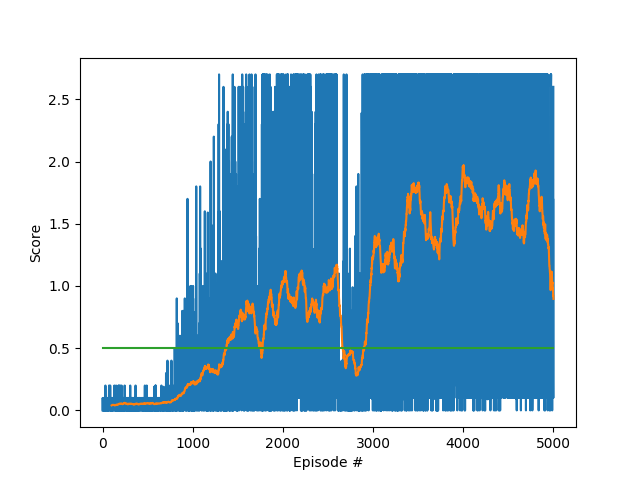

#Project 2: Continuous Control Project Submission Report

## Summary

For this project, I implemented Proximal Policy Optimization to solve the Reacher (20 agents) environment in around 180 episodes. 
The Policy-Network used was simply fully connected.

## Algorithm choice

When I started with this project, I used DDPG as suggested by the course material. 
But regardless of the hyperparameters chosen, I could not get the network to get even close to the required score (mostly < 1).
The training seemed to be very unstable and also very sensitive to all hyperparameters. 
Looking out for alternatives, I looked into D4PG or A3C to stabilize the training.
 
In the end I settled for PPO, because 
1. The techniques required is quite different to DDPG (or D4PG) and is also not so related to the previous assignment of a DQN
2. Training on whole trajectories/approximating the policy gradient is promising faster convergence for sparse rewards which this assignment seems perfect for
3. The implementation seemed quite straight forward without any synchronization or other multithreading issues

The algorithm was implemented after [click here](https://arxiv.org/abs/1707.06347):
 
```
Proximal Policy Optimization Algorithms
John Schulman, Filip Wolski, Prafulla Dhariwal, Alec Radford, Oleg Klimov

```

## Software Structure

### How to run

#### Training 
In order to train the agent, please run ```trainAgent.py```. This will
1. Setup the unity environment
2. Setup the agent with used hyperparameters
3. Train the agent and show the trained rewards
4. Save the best model weights in model/model.pth

#### Inference
In order to run the already trained agent, please run ```runAgent.py```

### Policy Network 
```Model.py``` contains the class ```PPOPolicyNetwork``` that represents the learned policy. 
Given a state input x, the network will provide a sampled action, the log-probability of selecting that action 
and the estimated value of the (x,a) pair for the rest of the epoch 

### PPOAgent
```PPOAgent.py``` contains the code to train the policy based on *Proximal Policy Optimization* (PPO). 

The ```Agent``` class is not aware of the structure of the policy representation, so different implementations can be plugged in on construction. 

## Chosen Network structure
As the state and action space are both relatively small, I decided to use a fully connected layers with 2 hidden layers with 512 neurons each.

## Chosen Hyperparameters for training

| Parameter           | Value         |   Description                                                                     | 
| -------------       |:-------------:| -------------------------------------------------------------------------------   | 
| learning_rate       | 3e-4          | Hyperparameter for model weight updates                                           |
| adam_epsilon        | 1e-5          | Epsilon parameter for adam optimizer                                              | 
| hidden_size         | 512           | size of each layer of the policy network (2 fully connected layers                |   
| rollout_length      | 2000          | The number of steps to collect trajectories for approximating the policy gradient | 
| mini_batch_number   | 32            | The number of minibatches to train based on the collected rollouts                | 
| optimization_epochs | 10            | The number of epochs to train with one set of rollouts                            |
| ppo_clip            | 0.2           | Clipping for the objective function                                               |
| gradient_clip       | 5.0           | Clipping for overall loss gradient                                                |
| entropy_coefficent  | 0.01          | How much is the entropy loss term weighted against the objective loss term        | 
| discount_rate       | 0.99          | Discount factor of the reward function                                            |
| lambda              | 0.95          | Additional (to discount rate) downscaling of advantages over time                 |

## Results

With the described model structure and hyperparameters, 
the agent was able to solve (average score>30 in 100 episodes) the environment in less than 200 episodes:


blue shows the socre for each episode, orange the average score over the last 100 episodes and 
green shows the desired score (30) in order to solve the environment.
Note, that I let it train a little longer (around 250 episodes) to see that the policy converges.

Here is a gif of the resulting policy:


The trained model weights are saved in model/model.pth

## Future Improvements

1. Try to solve the single-agent version
2. Hyperparameter tuning to get faster convergence (also for the single-agent version)
3. Implement Truly PPO [Truly PPO paper](https://arxiv.org/abs/1903.07940) to even further increase convergence ("improves the original PPO on both sample efficiencyand performance").